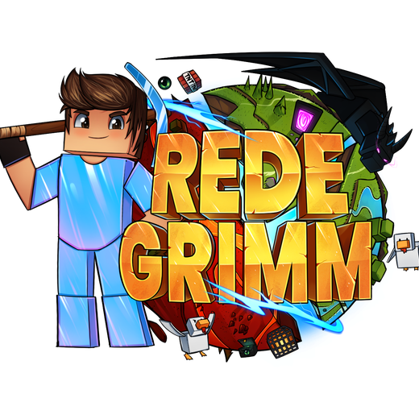

  
  
   

  *Transformando ideias em código e arquitetando sistemas escaláveis.*
  
  
  

---

### 👨‍💻 Sobre Mim
Olá! Eu sou o **Lovv3rr**, um desenvolvedor apaixonado por criar sistemas robustos, infraestrutura e aplicações web. Tenho um forte background no ecossistema Java/Kotlin, focado em backend, arquitetura de servidores e plugins.

- 🔭 Atualmente desenvolvendo a **[Rede Grimm](#)** e meus projetos pessoais.
- 🌱 Aprendendo sempre mais sobre arquitetura de software e novas tecnologias web.
- ⚡ Fato curioso: Consigo transformar café em código funcional.

---

### 🚀 Projetos em Destaque

  
  <h4 align="left">Rede Grimm</h4>
  
Um network de Minecraft focado em trazer a melhor experiência de Survival e Factions, com sistemas próprios e economia customizada. Atuo como Desenvolvedor e Administrador principal deste projeto.

   

---

### 💻 Meu Arsenal de Ferramentas

#### ⚔️ Backend & Minecraft

  
  
  
  

#### 🌐 Desenvolvimento Web

  
  
  
  
  
  

#### ⚙️ Infraestrutura & Banco de Dados

  
  
  

---

### 📈 Estatísticas 

  
  
   
  

